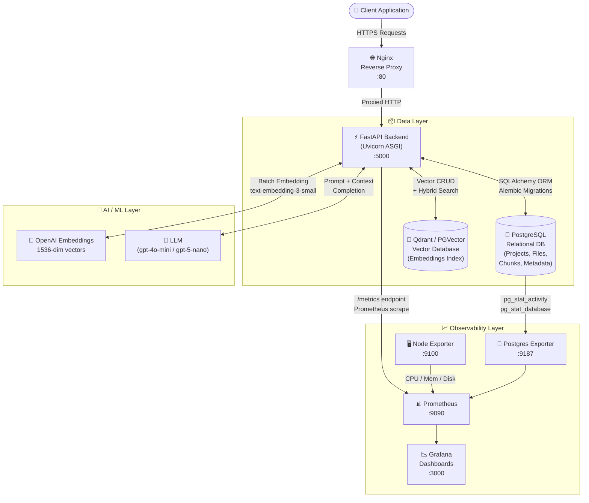
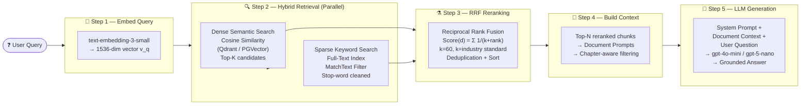
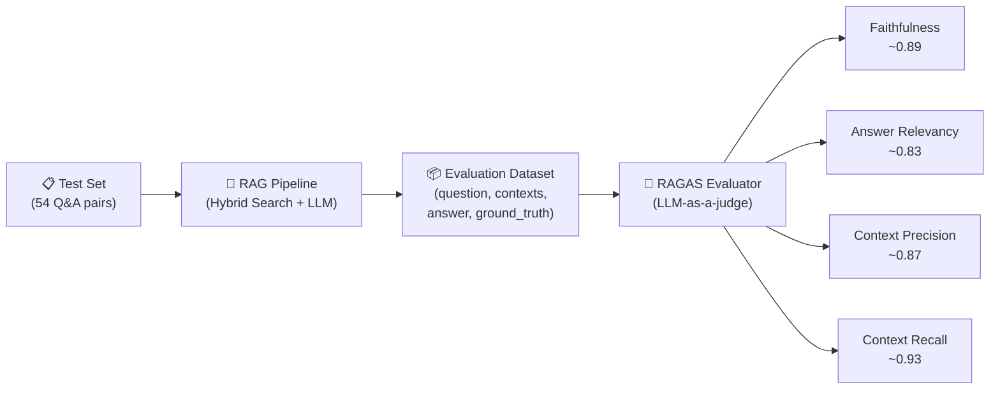

<div align="center">

# 🎓 UniAct RAG Application

### A Production-Grade Retrieval-Augmented Generation System

*Built for accuracy, built for scale.*

---


</div>

---

## 📑 Table of Contents

1. [System Overview](#-system-overview)
2. [Full Architecture Diagram](#-full-architecture-diagram)
3. [RAG Pipeline Deep Dive](#-rag-pipeline-deep-dive)
4. [Core Techniques & Algorithms](#-core-techniques--algorithms)
   - [Document Ingestion & OCR](#1-document-ingestion--ocr-with-docling--easyocr)
   - [Text Chunking Strategy](#2-text-chunking--chapter-extraction)
   - [Embedding Models](#3-embedding-models--dense-vectors)
   - [Hybrid Search: Semantic + Keyword](#4-hybrid-search-semantic--keyword)
   - [BM25 & Keyword Retrieval](#5-keyword-retrieval--the-bm25-principle)
   - [Reciprocal Rank Fusion (RRF)](#6-reciprocal-rank-fusion-rrf---the-reranker)
5. [Technology Stack](#-technology-stack)
6. [RAGAS Evaluation Framework](#-ragas-evaluation-framework)
7. [API Endpoints Overview](#-api-endpoints-overview)
8. [Installation & Setup](#-installation--setup)
9. [Docker Deployment](#-docker-deployment)
10. [Monitoring & Observability](#-monitoring--observability)

---

## 🌟 System Overview

**UniAct RAG Application** is a fully containerized, production-ready Retrieval-Augmented Generation (RAG) backend. It allows users to upload documents (PDFs, TXTs), intelligently chunk and index them into a vector database, and query the system using a powerful **hybrid retrieval pipeline** (semantic search + keyword search) fused via **Reciprocal Rank Fusion (RRF)**, before generating grounded answers via an LLM.

The system is built on a provider-agnostic architecture — it supports both **Qdrant** and **PGVector** as the vector store, and **OpenAI** or **Cohere** as the LLM/embedding provider, configurable via environment variables.

---

## 🏛️ Full Architecture Diagram

This diagram shows the complete system — from the client making a request all the way through to the LLM generating an answer, including the observability stack.



---

## 🔬 RAG Pipeline Deep Dive

This diagram focuses exclusively on the RAG pipeline — from a user's raw question to the final grounded answer, highlighting every technique applied.



---

## ⚙️ Core Techniques & Algorithms

### 1. Document Ingestion & OCR with Docling + EasyOCR

Documents are ingested via two supported parsers, with automatic fallback:

**Primary Parser — PyMuPDF (Fitz):**
Fast, native PDF text extraction for digitally-created (non-scanned) PDFs. Used by default for performance.

**Fallback Parser — Docling + EasyOCR:**
When PyMuPDF fails or the document is a scanned image-based PDF, the system falls back to **Docling** — a state-of-the-art document understanding library. Docling uses:
- **EasyOCR** under the hood to perform optical character recognition on scanned pages.
- Outputs clean **Markdown** representation, preserving headings and structure.
- Runs on **CPU** (CUDA is explicitly disabled for portability).

```
Uploaded PDF
     │
     ├──[Digital PDF]──► PyMuPDFLoader ──► page_content[]
     │
     └──[Scanned / Failure]──► Docling + EasyOCR ──► Markdown ──► page_content[]
```

**Supported File Types:** `.pdf`, `.txt`

---

### 2. Text Chunking & Chapter Extraction

After loading, the full document text is split into chunks for indexing:

**Chapter Detection:**
The system uses `PDFChapterParser` (fitz-based) to detect chapter boundaries using heading patterns (`#`, `##`). Each chunk is then **tagged with its chapter title** as metadata. This enables precise chapter-level filtering during search.

**Chunking Strategy — Custom Line Splitter:**
Unlike naive fixed-character splitting, we use a custom line-aware splitter:
- Split the full text by newlines `\n`
- Accumulate lines into a chunk until the chunk exceeds `chunk_size` characters
- Finalize the chunk, tag it with its detected chapter, and start fresh
- Overlap is currently not used to keep chunks clean

```python
# Chunk metadata enrichment
chunk_metadata = {
    "file_id": "abc123.pdf",
    "page": 3,
    "chapter_title": "Introduction to Neural Networks"
}
```

This granular metadata is indexed into the vector database and enables **file-level** and **chapter-level** filtered search at query time.

---

### 3. Embedding Models & Dense Vectors

When chunks are indexed, each chunk's text is converted into a **dense vector** via an embedding model.

**Model Used:** `text-embedding-3-small` (OpenAI)
**Output Dimension:** 1536 floats per document

The embedding model is queried differently based on document type:
- **Document Mode** (`DocumentTypeEnum.DOCUMENT`): Used when indexing chunks.
- **Query Mode** (`DocumentTypeEnum.QUERY`): Used when embedding a user's search query (some models apply asymmetric embedding for better retrieval).

**Cosine Similarity** is the distance metric used to compare the query vector $v_q$ against all stored document vectors $v_d$:

$$\text{Cosine Similarity}(v_q, v_d) = \frac{v_q \cdot v_d}{\|v_q\| \cdot \|v_d\|}$$

A score of **1.0** means the vectors are identical (perfect semantic match). A score of **0.0** means they are orthogonal (no semantic relationship).

The Qdrant collection is configured with a **payload text index** on the `text` field at creation time, enabling the keyword search leg of the hybrid pipeline.

---

### 4. Hybrid Search: Semantic + Keyword

The core retrieval innovation of this system is its **Hybrid Search** approach. Instead of relying solely on one retrieval method, we run **two specialized retrievers concurrently** using Python's `asyncio.gather()` and then fuse their results:

```
User Query
    │
    ├──[Embed Query]──► Dense Vector v_q
    │                       │
    │                       ▼
    │               Qdrant ANN Search  ────────────────────┐
    │               (Cosine Similarity)                    │
    │                                                      ▼
    └──[Clean Keywords]──► stop-word filter           RRF Fusion
                               │                          ▲
                               ▼                          │
                       Qdrant Keyword Search  ────────────┘
                       (MatchText Full-Text Index)
```

**Why Hybrid?**

| Method | Strength | Weakness |
|---|---|---|
| **Semantic Search** | Understands intent and paraphrases | Misses exact terms, names, codes |
| **Keyword Search** | Exact term matching | No intent understanding, brittle with synonyms |
| **Hybrid (Combined)** | Best of both worlds | Requires careful fusion |

**Stop-word Filtering for Keyword Search:**
Before the keyword leg is run, the user's query is cleaned by removing common English stop words (e.g., "a", "the", "is", "of") and punctuation. This is critical because Qdrant's `MatchText` filter uses **AND-matching** (all terms must appear). Stop words like "what is the" would cause zero results. Only meaningful content words are passed to the keyword search.

Each retriever fetches `max(limit × 3, 20)` candidates (over-fetch) to give the RRF fusion algorithm a rich pool of candidates to rank and select from.

---

### 5. Keyword Retrieval & the BM25 Principle

Our keyword search leverages **Qdrant's built-in full-text index** (`TextIndexType.TEXT`), which stores an inverted index on the `text` payload field. This is functionally equivalent to a simplified **BM25** retrieval model.

**BM25 (Okapi BM25)** is the gold-standard probabilistic ranking function used in search engines (Elasticsearch, Solr, Lucene all use it). Its formula is:

$$\text{BM25}(d, q) = \sum_{t \in q} \text{IDF}(t) \cdot \frac{f(t,d) \cdot (k_1 + 1)}{f(t,d) + k_1 \cdot \left(1 - b + b \cdot \frac{|d|}{\text{avgdl}}\right)}$$

Where:
- $t$ = each query term
- $f(t, d)$ = term frequency of $t$ in document $d$
- $|d|$ = length of document $d$ in words
- $\text{avgdl}$ = average document length across the corpus
- $k_1$ = term frequency saturation parameter (typically **1.2 – 2.0**)
- $b$ = length normalization parameter (typically **0.75**)
- $\text{IDF}(t)$ = Inverse Document Frequency:

$$\text{IDF}(t) = \log \frac{N - n(t) + 0.5}{n(t) + 0.5}$$

Where:
- $N$ = total number of documents
- $n(t)$ = number of documents containing term $t$

**Key intuitions from BM25:**
- **IDF** gives higher weight to rare, specific terms (e.g., "mitochondria") and discounts common words (e.g., "the").
- **TF saturation** ensures that a term appearing 100 times doesn't weigh 100× more than one appearing 10 times — the benefit diminishes.
- **Length normalization** prevents long documents from dominating just because they have more words.

---

### 6. Reciprocal Rank Fusion (RRF) — The Reranker

After the two retrievers return their ranked lists, we must combine them into a single, unified ranking. We use **Reciprocal Rank Fusion (RRF)** — a mathematically elegant, parameter-light fusion algorithm originally proposed by Cormack, Clarke & Buettcher (2009).

**The RRF Formula:**

$$\text{RRF Score}(d) = \sum_{r \in R} \frac{1}{k + \text{rank}_r(d)}$$

Where:
- $d$ = a document in the combined result pool
- $R$ = the set of rankers (in our case: {Semantic Search, Keyword Search})
- $\text{rank}_r(d)$ = the 1-based rank position of document $d$ in ranker $r$'s list
- $k$ = a smoothing constant. **We use $k = 60$**, the value from the original paper.

**Why $k = 60$?**

The constant $k$ dampens the contribution of very highly-ranked documents. Without it ($k=0$), the top-ranked document in any single ranker would get a score of $\frac{1}{1} = 1.0$, completely dominating the fusion. With $k=60$, even the top-ranked document only contributes $\frac{1}{61} \approx 0.016$, making the fusion much more balanced and resilient to any single ranker's errors.

**Worked Example:**

Suppose the Semantic Search returns `[Doc_A, Doc_B, Doc_C]` and the Keyword Search returns `[Doc_C, Doc_A, Doc_D]`.

| Document | Semantic Rank | Keyword Rank | RRF Score |
|---|---|---|---|
| **Doc_A** | 1 | 2 | $\frac{1}{60+1} + \frac{1}{60+2} = 0.01639 + 0.01613 = \mathbf{0.03252}$ |
| **Doc_C** | 3 | 1 | $\frac{1}{60+3} + \frac{1}{60+1} = 0.01587 + 0.01639 = \mathbf{0.03226}$ |
| **Doc_B** | 2 | — | $\frac{1}{60+2} = \mathbf{0.01613}$ |
| **Doc_D** | — | 3 | $\frac{1}{60+3} = \mathbf{0.01587}$ |

**Final RRF Ranking: Doc_A → Doc_C → Doc_B → Doc_D**

Documents that consistently appear across multiple rankers (Doc_A, Doc_C) naturally rise to the top. Documents unique to a single ranker (Doc_B, Doc_D) rank lower.

**Implementation detail:** Documents are deduplicated using their stable `document_id` from Qdrant. If no ID is present (e.g., PGVector), a hash of the text content is used as the deduplication key.

---

## 🛠️ Technology Stack

### Backend & Framework

| Technology | Version | Role |
|---|---|---|
| **Python** | 3.11+ | Core language |
| **FastAPI** | 0.129+ | Async REST API framework (ASGI) |
| **Uvicorn** | 0.41+ | ASGI server running FastAPI |
| **Pydantic / pydantic-settings** | v2 | Data validation & settings management |
| **LangChain** | 1.2+ | Document loaders, text splitters, LLM wrappers |
| **asyncpg** | 0.31+ | Async PostgreSQL driver |

### AI / ML

| Technology | Role |
|---|---|
| **OpenAI API** (`openai` 2.21+) | Text generation (gpt-4o-mini, gpt-5-nano) + Embeddings (text-embedding-3-small) |
| **Cohere API** (`cohere` 5.20+) | Alternative LLM/embedding provider |
| **text-embedding-3-small** | 1536-dim dense embedding model for semantic search |
| **Docling** (2.95+) | Advanced document parsing: PDF → Markdown with layout understanding |
| **EasyOCR** | OCR engine for scanned / image-based PDFs |
| **PyMuPDF (Fitz)** | Fast native PDF text extraction (primary parser) |
| **NLTK** | Natural language processing utilities (stop-word lists) |
| **RapidFuzz** | Fast fuzzy string matching |

### Databases

| Technology | Role |
|---|---|
| **PostgreSQL** | Primary relational database: projects, files, data chunks, assets |
| **PGVector** (`pgvector` extension) | Turns PostgreSQL into a vector database via `vector` column type and HNSW/IVFFlat indexing |
| **Qdrant** | Dedicated high-performance vector database. Supports both on-disk and in-memory modes. Used for semantic + keyword hybrid search. |
| **SQLAlchemy** 2.0 | ORM with async support for PostgreSQL |
| **Alembic** | Database schema migration tool |

### Infrastructure & DevOps

| Technology | Role |
|---|---|
| **Docker** & **Docker Compose** | Containerization and multi-service orchestration |
| **Nginx** | Production reverse proxy, load balancer |
| **uv** | Ultra-fast Python package manager (replaces pip/poetry) |
| **Prometheus** | Time-series metrics scraping and storage |
| **Grafana** | Visualization dashboards for operational metrics |
| **Postgres Exporter** | Exports PostgreSQL internal statistics to Prometheus |
| **Node Exporter** | Exports host-level metrics (CPU, RAM, disk) to Prometheus |
| **prometheus-client** + **starlette-exporter** | Exposes FastAPI HTTP metrics at `/metrics` |

### Evaluation

| Technology | Role |
|---|---|
| **RAGAS** (0.2+) | RAG evaluation framework — Faithfulness, Answer Relevancy, Context Precision, Context Recall |
| **langchain-openai** | Bridges OpenAI models into the RAGAS LangChain evaluation pipeline |
| **Hugging Face Datasets** | Dataset format used by RAGAS for evaluation input |

---

## 📊 RAGAS Evaluation Framework

The system's RAG pipeline is formally evaluated using the **RAGAS** (Retrieval-Augmented Generation Assessment) framework. RAGAS provides four quantitative metrics that objectively measure both the retrieval quality and generation quality independently.

### Evaluation Architecture



### The Four RAGAS Metrics

#### 1. 🎯 Faithfulness
> *"Is the answer grounded in the retrieved documents, or is the LLM hallucinating?"*

The generated answer is decomposed into atomic statements. Each statement is verified against the retrieved context to check if it can be inferred from it.

$$\text{Faithfulness} = \frac{\text{Number of claims verifiable from context}}{\text{Total number of claims in the answer}}$$

**Score Range:** 0 to 1. A score of **1.0** means every claim in the answer is fully supported by the retrieved documents (zero hallucination).

#### 2. 💬 Answer Relevancy
> *"Does the generated answer actually address the user's question?"*

An LLM judge is prompted to generate several artificial questions for which the generated answer would be an appropriate response. The cosine similarity between those generated questions and the original user question is measured.

$$\text{Answer Relevancy} = \frac{1}{N}\sum_{i=1}^{N} \text{CosineSim}(q_{\text{original}},\, q_{\text{generated},i})$$

**Score Range:** 0 to 1. Penalizes answers that are factually correct but off-topic, verbose, or evasive.

#### 3. 🗂️ Context Precision
> *"Are the most useful retrieved chunks ranked at the top?"*

Measures whether the relevant context items appear at the *beginning* of the retrieved list. Since LLMs have recency/primacy bias, ranking matters enormously.

$$\text{Context Precision@K} = \frac{\sum_{k=1}^{K} \left(\text{Precision@k} \times v_k \right)}{\text{Number of relevant items in top K}}$$

Where $v_k = 1$ if the item at rank $k$ is relevant, 0 otherwise.

**Score Range:** 0 to 1. A high score means your retriever is not just finding the right documents but ranking them correctly.

#### 4. 🔍 Context Recall
> *"Did the retriever find ALL the information needed to answer the question?"*

Each sentence in the ground-truth reference answer is checked to see whether it can be attributed to the retrieved context.

$$\text{Context Recall} = \frac{\text{Ground-truth sentences attributable to context}}{\text{Total ground-truth sentences}}$$

**Score Range:** 0 to 1. A low score means the retriever missed critical information, making it impossible for the LLM to produce a complete answer.

### Evaluation Results (54 Q&A Pairs)

| Metric | Score | Interpretation |
|---|---|---|
| **Faithfulness** | **~0.89** | ✅ Very low hallucination rate |
| **Answer Relevancy** | **~0.83** | ✅ Answers are focused and on-topic |
| **Context Precision** | **~0.87** | ✅ Most useful chunks ranked at top |
| **Context Recall** | **~0.93** | ✅ Retriever captures nearly all needed information |

> **Testset Generation:** The evaluation testset was generated by directly prompting `llama-3.3-70b-versatile` (via Groq) on batches of document chunks, producing diverse question-answer pairs that reflect real user queries. See `notebooks/` for the full evaluation pipeline.

---

## 🌐 API Endpoints Overview

> 📄 For full request/response schemas and examples, see [`endpoints.md`](./endpoints.md).

| Method | Endpoint | Description |
|---|---|---|
| `GET` | `/api/v1/` | Health check / app info |
| `POST` | `/api/v1/data/upload/{project_id}` | Upload a document file |
| `POST` | `/api/v1/data/process/{project_id}` | Parse and chunk a document |
| `GET` | `/api/v1/data/files/{project_id}` | List project files |
| `POST` | `/api/v1/nlp/index/push/{project_id}` | Embed chunks & push to vector DB |
| `GET` | `/api/v1/nlp/index/info/{project_id}` | Get vector collection stats |
| `POST` | `/api/v1/nlp/index/search/{project_id}` | Hybrid search (semantic + keyword + RRF) |
| `POST` | `/api/v1/nlp/index/answer/{project_id}` | RAG question answering |
| `POST` | `/api/v1/nlp/index/exam/{project_id}` | Generate MCQ + written exam from context |
| `POST` | `/api/v1/nlp/index/evaluate/{project_id}` | RAGAS evaluation endpoint |

---

## 💻 Installation & Setup

### Requirements

- Python **3.11+**
- [uv](https://docs.astral.sh/uv/getting-started/installation/) (ultra-fast package manager)
- Docker & Docker Compose (for containerized deployment)

### Install Dependencies

```bash
# Install uv if not already installed
curl -LsSf https://astral.sh/uv/install.sh | sh

# Sync project dependencies from uv.lock
uv sync
```

### Setup Environment Variables

```bash
cp src/.env.example src/.env
```

Edit `src/.env` with your API keys and database credentials:

```env
OPENAI_API_KEY=sk-...
GROQ_API_KEY=gsk_...
VECTOR_DB_PROVIDER=qdrant         # or pgvector
GENERATION_BACKEND=openai
EMBEDDING_BACKEND=openai
GENERATION_MODEL_ID=gpt-4o-mini
EMBEDDING_MODEL_ID=text-embedding-3-small
EMBEDDING_MODEL_SIZE=1536
```

### Run Database Migrations

```bash
uv run python -m alembic -c src/models/db_schemes/ragapp/alembic.ini upgrade head
```

### Run the FastAPI Development Server

```bash
cd src
uv run uvicorn main:app --reload --host 0.0.0.0 --port 5000
```

The API will be available at `http://localhost:5000` with interactive docs at `http://localhost:5000/docs`.

---

## 🐳 Docker Deployment

### 1. Configure Environment Files

```bash
cd docker/env
cp .env.example.app .env.app
cp .env.example.postgres .env.postgres
cp .env.example.grafana .env.grafana
cp .env.example.postgres-exporter .env.postgres-exporter

cd ../ragapp
cp alembic.example.ini alembic.ini
```

### 2. Start All Services

```bash
cd docker
docker compose up --build -d
```

### 3. Recommended Startup Order (Avoids Race Conditions)

```bash
# Step 1: Start databases first and let them initialize
docker compose up -d pgvector qdrant postgres-exporter

# Step 2: Wait for database health checks
sleep 30

# Step 3: Start the application and monitoring stack
docker compose up fastapi nginx prometheus grafana node-exporter --build -d
```

### 4. Start Only Core Services (No Monitoring)

```bash
docker compose up -d fastapi nginx pgvector qdrant
```

### 5. Full Reset (Remove All Containers, Volumes, and Data)

```bash
docker compose down -v --remove-orphans
```

### Service Access Points

| Service | URL | Notes |
|---|---|---|
| **FastAPI** | `http://localhost:5000` | Main API |
| **API Docs (Swagger)** | `http://localhost:5000/docs` | Interactive API explorer |
| **Nginx** | `http://localhost:80` | Reverse proxy |
| **Qdrant Dashboard** | `http://localhost:6333/dashboard` | Vector DB UI |
| **Prometheus** | `http://localhost:9090` | Metrics browser |
| **Grafana** | `http://localhost:3000` | Dashboards (`admin`/`admin_password`) |

### Useful Docker Commands

```bash
# Check all service statuses
docker compose ps

# Follow logs for a specific service
docker compose logs --tail=100 -f fastapi

# Restart a single service
docker compose restart fastapi

# Check database connectivity
docker compose logs --tail=50 pgvector
```

---

## 📈 Monitoring & Observability

### Prometheus Metrics

The FastAPI app exposes real-time metrics at `/metrics` (scraped automatically by Prometheus):

- **HTTP Request Rate** — requests per second per endpoint
- **Request Latency** — P50 / P95 / P99 histograms
- **Error Rate** — 4xx and 5xx status code distributions
- **Active Connections** — in-flight request count

### Grafana Dashboard Setup

1. Log in at `http://localhost:3000` (`admin` / `admin_password`)
2. Add Prometheus as Data Source: URL = `http://prometheus:9090`
3. Import the following pre-built dashboards:

| Dashboard | Grafana ID | Coverage |
|---|---|---|
| FastAPI Observability | [`18739`](https://grafana.com/grafana/dashboards/18739) | Request rates, latencies, errors |
| Node Exporter Full | [`1860`](https://grafana.com/grafana/dashboards/1860) | CPU, RAM, Disk, Network |
| Qdrant | [`23033`](https://grafana.com/grafana/dashboards/23033) | Vector DB operations, latency |
| PostgreSQL Exporter | [`12485`](https://grafana.com/grafana/dashboards/12485) | DB connections, query stats |

---

## 📜 License

This project is licensed under the terms of the [LICENSE](./LICENSE) file included in this repository.
